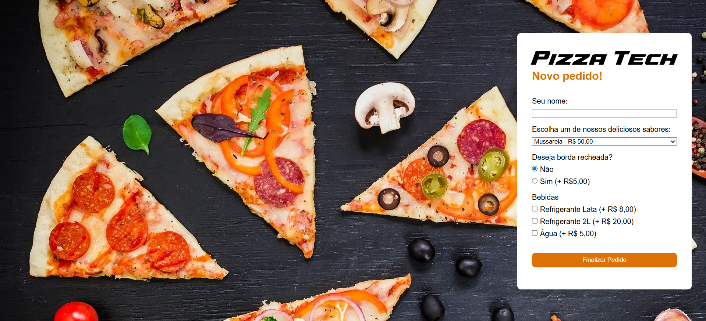
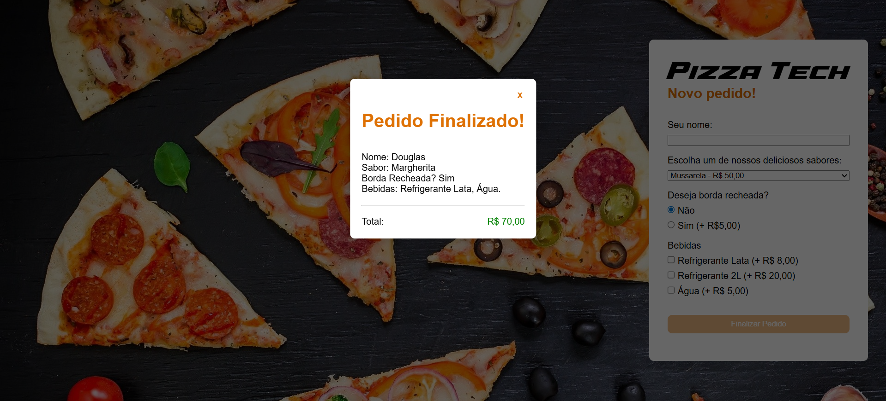
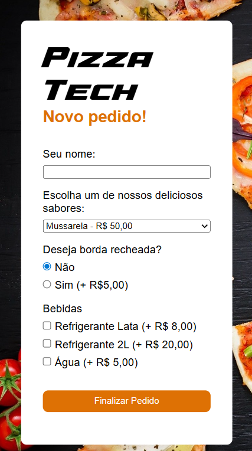
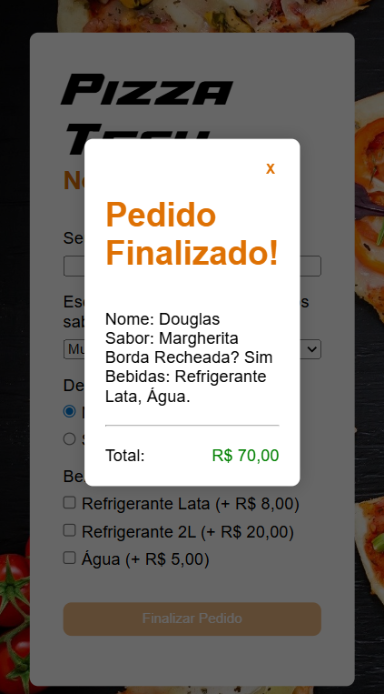

# PIZZA TECH
## Trabalho para a disciplina de Desenvolvimento Web II na Fatec Praia Grande

- **OBJETIVO**: Simular a realização de um pedido em uma pizzaria online, exibindo a comanda ao final.
- **LINGUAGENS**: PHP, JS.

## TELAS (DESKTOP)

- **Inicial**
&nbsp;

- **Pedido finalizado**
&nbsp;

## TELAS (SMARTPHONE)

- **Inicial**
&nbsp;

- **Pedido finalizado**
&nbsp;

